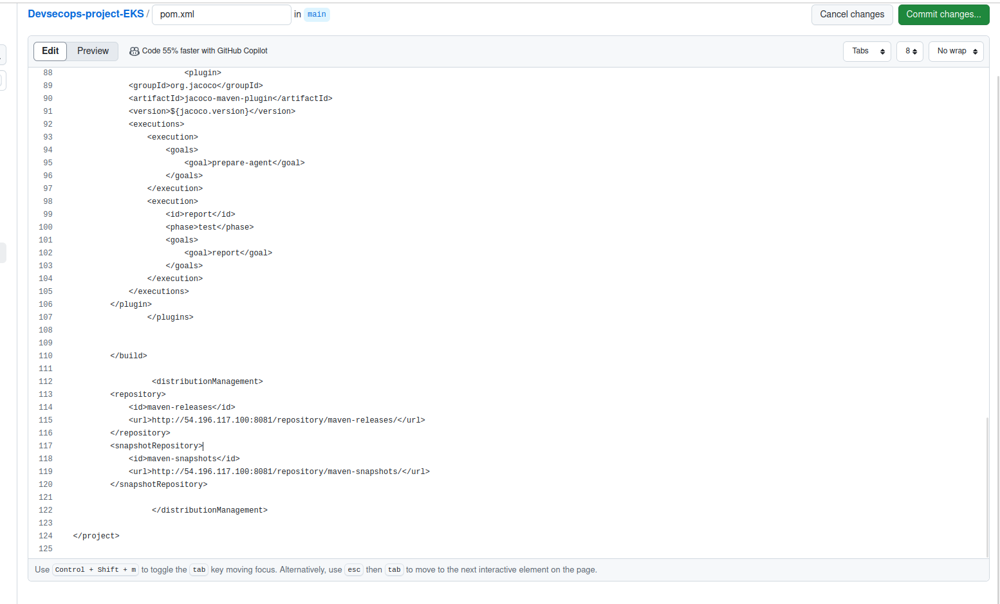
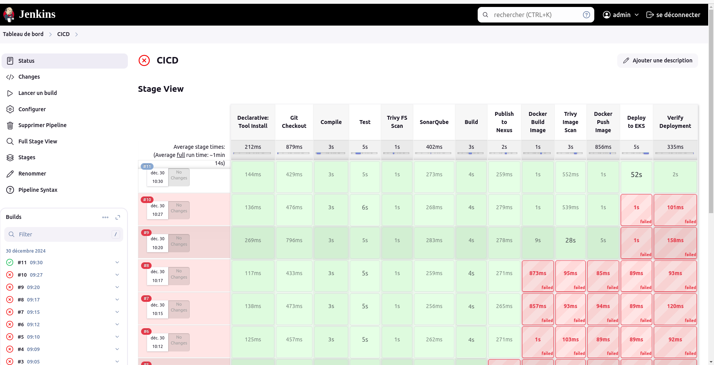
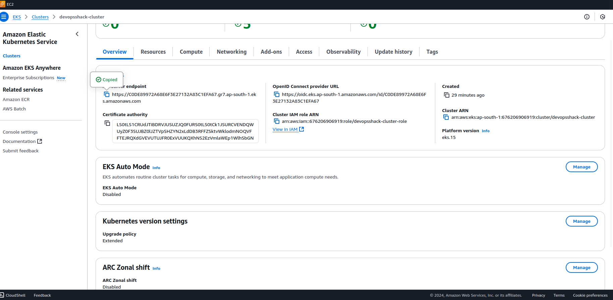
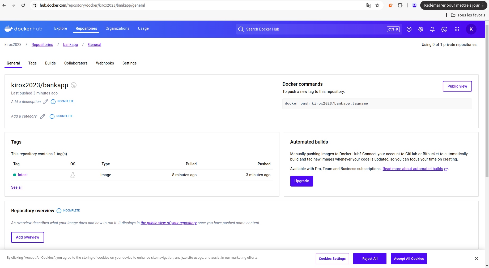
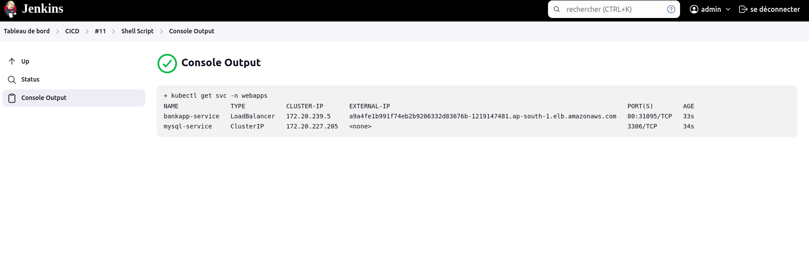
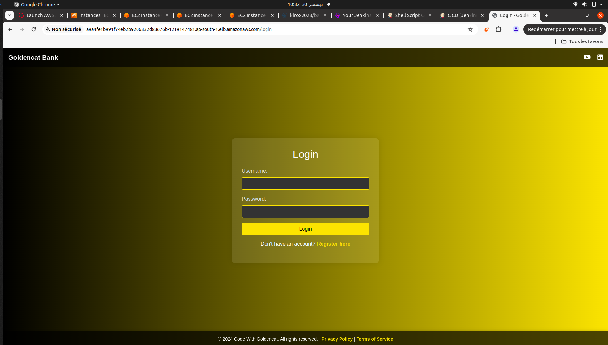
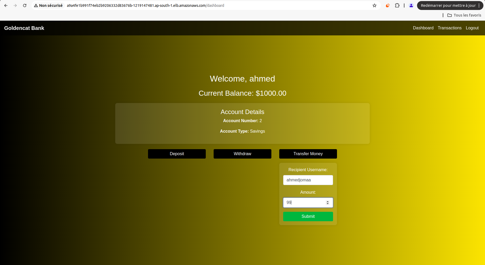
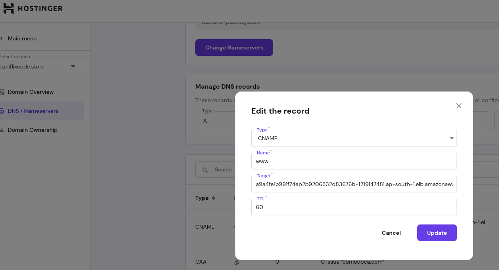
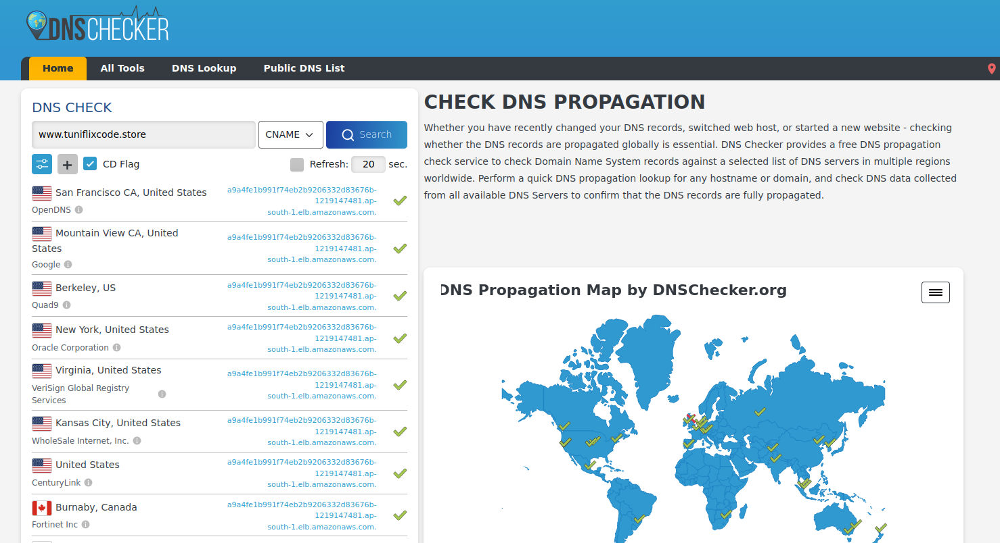
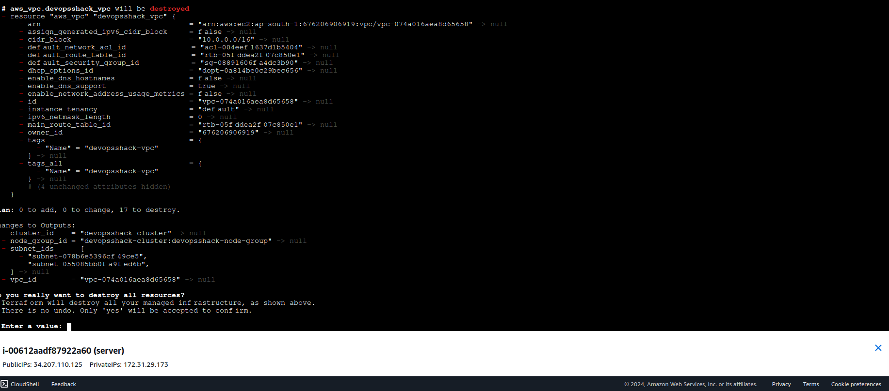

# DevSecOps Project Documentation

This documentation provides an overview of the DevSecOps project, demonstrating the setup of a CI/CD pipeline integrated with security tools for building and deploying applications to Amazon EKS.

---

## AWS EC2 Instance Setup

An EC2 instance was configured in the AWS Console to host essential DevSecOps tools such as Jenkins and Nexus. The instance is a `t2.medium` configured as follows:
This instance forms the backbone of the CI/CD pipeline setup.

## Jenkins Installation and Configuration

Jenkins, a key component for automation, was installed on the EC2 instance. To unlock Jenkins during the initial setup, an administrator password was retrieved from the server:
The image below shows the Jenkins unlock screen:

## Nexus Repository Manager Setup

Nexus Repository Manager OSS was deployed to manage dependencies securely. It supports Maven and NuGet repositories, ensuring secure artifact storage and retrieval. The following dashboard highlights the configured repositories and system health checks:

## Terraform Initialization for EKS

Terraform was initialized using the `terraform init` command to prepare the environment for provisioning the EKS cluster. The process successfully downloaded all required provider plugins, such as HashiCorp AWS.

## Planning EKS Infrastructure with Terraform

The `terraform plan` command outlined the infrastructure setup, including the creation of a Virtual Private Cloud (VPC), subnets, and related resources essential for the EKS cluster.

## EKS Cluster Provisioning Using Terraform

Terraform was used to configure the EKS cluster. The setup included defining node groups, scaling configurations, and network policies. This configuration ensures the Kubernetes cluster is ready for secure deployment.

The `pom.xml` file was edited to include the Nexus repository URLs. This update enables Maven to securely fetch project dependencies from Nexus during builds.

## Setting Up Kubernetes RBAC

Role-Based Access Control (RBAC) was configured to manage secure access to Kubernetes resources. This setup ensures that permissions are granted only to authorized users and services.

## Terraform Execution for EKS Deployment

The final infrastructure was provisioned using the `terraform apply` command. The process successfully created the VPC, subnets, and EKS node groups, completing the cluster setup.

## Verifying EKS Cluster with kubectl

After provisioning, the EKS cluster was verified using the `kubectl get nodes` command. The output confirms that the nodes are up and running, ready for workload deployment.

---

## Creating a Service Account

A Kubernetes Service Account was created to enable secure communication between Jenkins and the EKS cluster. This ensures that the CI/CD pipeline can interact with Kubernetes resources securely.

---

## Creating Roles and Role Bindings

Roles and Role Bindings were defined to provide fine-grained access control to Kubernetes resources. These configurations ensure that the CI/CD pipeline has the necessary permissions to manage deployments.

---

## Creating and Describing Kubernetes Token

A new Kubernetes token was created and its details were described using the `kubectl describe secret` command. This token will be used by Jenkins for cluster access.

---

## Configuring Kubernetes Token in Jenkins

A Kubernetes token was generated and configured in Jenkins. This token allows Jenkins to authenticate with the EKS cluster securely, enabling it to execute deployment tasks.

---

## Pipeline Execution in Jenkins

A CI/CD pipeline was configured and executed in Jenkins. The pipeline integrates multiple stages such as build, test, security scans, and deployment to Kubernetes.

---

## EKS Endpoint Overview

The Amazon EKS cluster's endpoint was verified to ensure proper connectivity and configuration.

---

## Pushing Images to Docker Hub

Containerized application images were successfully built and pushed to Docker Hub using the CI/CD pipeline.

---

## Deploying to Kubernetes Load Balancer

The application was deployed to the Kubernetes cluster using a LoadBalancer service, enabling external access to the application.

---
## Application Deployment and Testing

The deployed application was accessed and tested on the configured EKS cluster. Below are some screenshots of the application in action:

---

## DNS Configuration and Verification

A custom domain was configured using Hostinger to map the application's external load balancer address. Below are the steps and verification results:

---

## Terraform Destroy

After successfully testing the deployment, the infrastructure was cleaned up using `terraform destroy` to ensure resources were removed and no unnecessary costs were incurred.

